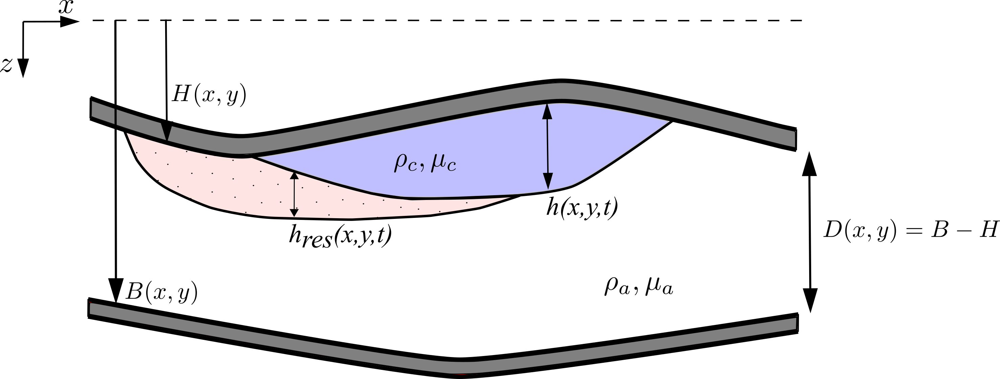

<!-- README.md -->

# CO2GraVISim

This is an overarching readme for the **CO<sub>2</sub>** **Gra**vity-controlled, **V**ertically **I**ntegrated **Sim**ulator, CO2GraVISim, a reduced-physics model of the flow of CO<sub>2</sub> in a confined porous reservoir.
The model incorporates spatially variability in ceiling and basement topography, porosity, and permeability, along with residual trapping and dissolution.

This code and model were developed as part of the StrataTrapper project. All comments and queries can be directed towards [ajb278@cam.ac.uk](mailto:ajb278@cam.ac.uk).

---

## Index

- [Running CO2GraVISim](#running-co2gravisim)
- [Model Description](#model-description)
- [File Structure](#file-structure)
- [Input Formats](#input-formats)
- [Code Summary](#code-summary)
- [Code Output](#code-output)
- [Licence](#licence)

## Running CO2GraVISim

To fully run the simulator from scratch:

0. [Compile the code](#compiling-the-code)
1. [Specify inputs](#specify-inputs)
2. [Run the simulator](#running-the-simulator)
3. [Process outputs](#processing-outputs)

Once the apropriate executables have been created, Step 0 can be skipped and the input files in Step 1 can be amended as necessary. Step 0 only needs to be repeated if the Fortran source files are modified.

### Compiling the Code

The main solver for CO2GraVISim consists of a number of Fortran program and module files stored in `\src_files\`. As such, it must be compiled before it can be run. This can be done on Windows using the `build_CO2GraVISim__Windows.bat` batch script and or Linux or Unix/Mac systems using the `build_CO2GraVISim__Linux.sh` script.
For example, in Windows simply run

```cmd
C:\....\CO2GraVISim> build_CO2GraVISim__Windows.bat
```

By default, these build files attempt to use the `gfortran` compiler to construct the executable files. The files involved in Step 0 can be modified simply to instead use a different compiler, such as `ifx`, if necessary. For instructions on installing `gfortran` on your system, see [https://fortran-lang.org/learn/os_setup/install_gfortran/](https://fortran-lang.org/learn/os_setup/install_gfortran/). The code provided here has been tested using `gfortran v14.1.0`.

On Linux systems, it may be necessary to modify the read-write status of the build file in order to run it. This can be done by running `chmod 744 build_CO2GraVISim__Linux.sh` from within the relevant file path.

#### FoX XML Library

This version of CO2GraVISim utilises the [FoX XML library for Fortran](https://fortranwiki.org/fortran/show/FoX) to read in simulation inputs from an XML file. The appropriate FoX files thus must be included when compiling CO2GraVISim. For Windows, pre-compiled files are provided in `/src_files/FoX_files/`, with the build script set up to read from these. Alternatively, you can [obtain the FoX source files from https://github.com/andreww/fox](https://github.com/andreww/fox) and compile them directly using the provided Visual Studio project file, following the instructions here: [https://andreww.github.io/fox/Compilation.html](https://andreww.github.io/fox/Compilation.html).

On Linux or Unix, the FoX source files must be downloaded from [https://github.com/andreww/fox](https://github.com/andreww/fox) and compiled using `make` or `CMake`, as described here: [https://andreww.github.io/fox/Compilation.html](https://andreww.github.io/fox/Compilation.html). The variable `FoX_dir` in the build script `build_CO2GraVISim__Linux.sh` must then be set to the appropriate path for the `/FoX/fox-master/objs` subfolder.

### Specify Inputs

The input data for the simulation comes in two main parts:

- an XML input file specifying the majority of the model and simulator parameters for the simulation,
- spatial data, such as topography, permeability, and porosity, stored as arrays in text files.

For more details about these input data, see [Input XML File](#input-xml-file) and [Spatial Structure](#spatial-structure) in [Input Formats](#input-formats).

The XML input file is read using the FoX XML library for Fortran (see [FoX Homepage](https://homepages.see.leeds.ac.uk/~earawa/FoX/) for more details).

### Running the Simulator

The compilation process described in [Compiling the Code](#compiling-the-code) will produce `CO2GraVISim_single_run.exe` for Windows, or `CO2GraVISim_single_run` for Linux/Unix. The program can then be run from the command line, for example using the following:

```cmd
C:\....\CO2GraVISim>CO2GraVISim_single_run.exe -input .\Input\Sleipner -xml .\Input\Sleipner\Sleipner.xml 
```

The program has a number of command line flags that are used to specify run-specific values for the simulation.

`-input [filepath]`: Sets the path to the folder containing the spatial array input files for the simulation (see [Specify Inputs](#specify-inputs) and [Spatial Structure](#spatial-structure)). If not set, the default value of `.\Input\` will be used.

`-xml [filepath]`: Sets the path to the input XML file for the simulation (see [Specify Inputs](#specify-inputs) and [Input XML File](#input-xml-file)). **This must be set for the simulator to run**.

`-output [filepath]`: Sets the path to the Output folder, where the outputs of the simulation are saved. This location must contain the subfolders `\Current_Pressure\`, `\Current_thickness\`, `\Current_Volume\`, and `\Other\`. If not set, the default value of `.\Output\` will be used.

`-confined`: Sets the simulator to run in `Confined` mode. If set, this will override any value specified in the XML input file.

`-unconfined`: Sets the simulator to run in `Unconfined` mode. If set, this will override any value specified in the XML input file.

`-batch [filepath]`: If a batch run is being performed, this flag can be used to set the `Input` folder, `Output` folder; **the XML path must still be specified separately**. For example, specifying

```cmd
-batch .\batch_runs\run_10 -xml .\batch_runs\run_10\Input\run_10.xml
```

 is the equivalent of

```cmd
-input .\batch_runs\run_10\Input -output .\batch_runs\run_10\Output -xml .\batch_runs\run_10\Input\run_10.xml
```

For more information, see [Batch Runs](#batch-runs).

While CO2GraVISim is running, a log of information about the simulation is printed to the command line (STDOUT). For more details about what appears here, see [Simulation Log](#simulation-log).

### Processing Outputs

At the end of a simulation, a series of output files are saved to the `Output` folder (`.\Output\` by default, or the value specified using the `-output` flag). These contain spatial arrays for the mobile current thickness $h$, residual trapping thickness $h_{res}$, the dynamic ambient pressure $P_{a}$, and associated volumes, each saved at the plot times specified in the XML file. Also saved are records of theses solutions at each timestep, as well as error measures and statistics for the simulation. For more information see [Code Output](#code-output).

A number of python scripts are provided for interpreting the simulation results, such as plotting the behaviour of the CO<sub>2</sub> over time. More information about these can be found in [Python Scripts](#python-scripts).

---

## Model Description



The flow inside the storage interval of interest is assumed to have the structure shown in the schematic above. The storage interval is bounded above by an impermeable ceiling layer (caprock), $z=H$, and below by an impermeable basement layer, $z=B$.

Assuming that:

1. The flow of the CO<sub>2</sub> is predominantly horizontal,
2. Gravity drives the CO<sub>2</sub> to build up beneath the caprock a short distance after the injection point,

we can take the pore pressure to be hydrostatic in the vertical direction at leading order, and vertically integrate the local continuity equations for the two fluids to arrive at a trio of coupled equations that control

- $h(x,y,t)$ - the thickness of the mobile CO<sub>2</sub> region,
- $h_{res}(x,y,t)$ - the thickness of the residually trapped CO<sub>2</sub> region,
- $P_{a}$ - the deviation from hydrostatic pressure in the ambient.

The flow is thus divided into three regions:

- **Mobile** ($H \leq z \leq H+h$, purple), consisting of mobile CO<sub>2</sub> and irreducible ambient,
- **Trapping** ($H+h \leq z \leq H+h+h_{res}$, pink), consisting of residually trapped CO<sub>2</sub> and mobile ambient,
- **Ambient** ($H+h+h_{res} \leq z \leq B$, white), consisting of only mobile ambient.

Each of these regions has fixed densities, viscosities, saturations, and relative permeabilities, which are specified via the XML input file.

A full description of the governing equations solved here can be found in `\docs\CO2GraVISim_model_description.pdf`.

## Nondimensionalisation and Dimensional Scales

The main solver for CO2GraVISim solves the nondimensional version of the mathematical model described above. Vertical length scales are scaled by $\mathcal{D}$, the mean distance between the ceiling and basement of the storage interval, and $\mathcal{Q}$, the mean volume flux over the times when injection is occuring. This then produces corresponding time and pressure scales

$$\mathcal{T} = \frac{\mathcal{D}^{3} }{\mathcal{Q}}
\, , \quad\quad
\mathcal{P} = \frac{\mu_{c}}{k_{0}}\frac{Q}{\mathcal{D}} \, ,
$$

where $k_{0}$ is the arithmetic mean of the permeability, and $\mu_{c}$ the viscosity of the injected CO<sub>2</sub>. This introduces the parameter

$$
\Gamma = \frac{u_{b}}{u_{Q}} =
\frac{ (\Delta \rho g k_{0} / \mu_{c})}{ (\mathcal{Q} / \mathcal{D}^{2} )} \, ,
$$

which is the ratio of the Darcy velocities set by buoyancy and injection respectively, and where $\Delta \rho = \rho_{a} - \rho_{c}$ is the density difference between the ambient and CO<sub>2</sub>. For $\Gamma \gg 1$ we would anticipate buoyancy effects dominating the behaviour of the flow and confinement having a secondary effect, while for $\Gamma \ll 1$ we would anticipate confinement playing an important role during injection.

This nondimensionalisation is only applied once the input parameters have been processed and the simulation results are redimensionalised before being saved, so that for the user everything 'outside' the simulator remains dimensional.

---

## Numerical Methods

The governing equations for the model consist of an Advection Diffusion equation for the mobile current thickness $h$, a Poisson equation for the dynamic pore pressure $P_{a}$, and comparatively simpler 1st-order PDE for the residually trapped thickness $h_{res}$. These are nonlinear, with coefficients depending on $h$, $P_{a}$, and $h_{res}$.

An adaptive timestepping routine is used to move the full system of equations through time, trying to take as big a timestep as possible while maintaining a suitable error value. This error is found by first taking a single timestep, repeating the process as two half-steps instead, and taking the L2 norm of the relative error between the two results. The choice of timestep is based on [Söderlind & Wang, J. Comp. Appl. Maths, 2006](https://doi.org/10.1016/j.cam.2005.03.008).

For the Advection Diffusion equation for $h$, the Il'in scheme is used to determine the appropriate coefficients for the discretised system that suitably balance the effects of advection and diffusion (see [Clauser & Kiesner, Geophys. J. R. astr. soc., 1987](https://doi.org/10.1111/j.1365-246X.1987.tb01658.x)). The ADI (Alternating-Direction Implicit) method is then used to stably solve the 2D problem in two half steps - first treating $x$ implicitly and $y$ explicitly for the first half of the timestep, and then vice-versa for the second half (see [Peaceman & Rachford, J. Soc. Indust. Appl. Math., 1955](https://doi.org/10.1137/0103003)).

The Poisson equation for the dynamic ambient pressure $P_{a}$ is solved using successive overrelaxation, iterating until the solution has converged to within a specified threshold.

Finally, the governing equation for $h_{res}$ is comparatively simpler, and is solved using Forward Euler once $h$ and $P_{a}$ have been determined.

As these equations are nonlinear, with coefficients depending on $h$, $P_{a}$, and $h_{res}$, each timestep ($t \rightarrow t+\Delta t$) is wrapped within a Predictor-Corrector method: the solution is advanced half a timestep ($t \rightarrow t+\Delta t/2$) in order to estimate the appropriate values of the coefficients, and then the full original timestep ($t \rightarrow t+\Delta t$) is taken using these values for the coefficients estimated at the midway point ($t+\Delta t/2$).

Combined with the ADI scheme, this means that each timestep is split into 4 parts. For the first half of the timestep ($t \rightarrow t+\Delta t/2$) the ADI method is applied in $x$, with coefficients first estimated at the midway point ($t+\Delta t/4$). The second half of the timestep ($t + \Delta/2 \rightarrow t+\Delta t$) is then taken with the ADI method applied in $y$, with coefficients estimated at the new midway point ($t+3\Delta t/4$).

The simulation grid for this numerical approach is assumed to be a regular Cartesian grid, $(n_{x} \times n_{y})$ with constant grid spacings $dx$ and $dy$ in the $x$ and $y$ directions respectively.

See [Code Summary](#code-summary) for the relevant module files that implement each of these.

---

## File Structure

[Example file structure for the full set of CO2GraVISim files]

<!-- TODO: update this once I have settled on the necessary files -->

<!-- ```bash
├───build_CO2GraVISim__Linux.sh
├───build_CO2GraVISim__Windows.bat
├───CO2GraVISim_install.zip
│
├───docs
│       README.md
│
├───Input
│       base_topo.txt
│       boundary_conditions.txt
│       ceil_topo.txt
│       flow_parameters.txt
│       grid_parameters.txt
│       injection_locations.txt
│       injection_profile.txt
│       permeability.txt
│       porosity.txt
│       target_plot_times.txt
│
├───Output
│   ├───Current_Pressure
│   │       placeholder_Current_Pressure.txt
│   │
│   ├───Current_Thickness
│   │       placeholder_Current_Thickness.txt
│   │
│   └───Other
│           placeholder_Other.txt
│
├───plots
│   ├───Overview_plot
│   │   └───temp
│   │           placeholder_Overview_plot.txt
│   │
│   ├───Reservoir_preview
│   │       placeholder_Reservoir_preview.txt
│   │
│   └───Slices_plot
│       └───temp
│               placeholder_Slices_plot.txt
│
├───python_scripts
│       Generate_Plot_times.py
│       Nondimensional_parameters.py
│       Overview_plot.py
│       Reservoir_preview.py
│       Slices_plot.py
│
└───src_files
        CO2GraVISim_global.f90
        CO2GraVISim_injection_profiles.f90
        CO2GraVISim_InputGen.f90
        CO2GraVISim_input_parameters.f90
        CO2GraVISim_single_run.f90
        CO2GraVISim_solver.f90 -->
<!-- ``` -->

---

## Input Formats

### Spatial structure

The numerical implementation of the model described above is designed assuming a regular, rectangular, $n_{x} \times n_{y} \times n_{z} $ grid. Grid points then have uniform spacings $dx$ and $dy$ in the $x$- and $y$-directions.

The 2D spatial input data -- the topography of the ceiling and basement layers of the storage interval -- are $(n_x \times n_y)$ arrays that are stored as $n_y$ rows of $n_x$ real-valued numbers, separated by spaces. These are read in from `ceil_topo.txt` and `base_topo.txt`, and are expressed in metres $m$.

In order to mimic the common structure of storage reservoirs, we think of the vertical structure of the reservoir in terms of the fraction $f$ of the distance between the ceiling ($z=H$) and basement ($z=B$) of the storage interval, i.e.

$$ f(i,j,k) = \frac{ z(i,j,k) - H(i,j) }{B(i,j) - H(i,j)} \, .$$

To reduce memory overhead, the vertical structure in 3D input arrays is assumed to be for datapoints that have **the same fraction vector $f$ for each column**, i.e.

$$ f(i,j,k) = f(k) \, .$$

This fraction vector is stored as `z_layers.txt`.

<!-- In order to mimic the common structure of storage reservoirs, and to reduce memory overhead, vertical information in a given $(i,j)$ column is taken to occur at fixed proportions of the way through that column (i.e. proportions of the distance between the ceiling and the basement). These proportions are specified via `z_layers.txt`, and are a single list of $n_{z}$ values that apply to every column in the grid. -->

The 3D spatial input data -- the porosity and absolute permeability of the storage interval -- are $(n_x \times n_y \times n_z)$ arrays that are stored as $n_z \times n_{y}$ rows of $n_x$ real-valued numbers, separated by spaces. The first $n_{y}$ rows then correspond to the shallowest layer of the storage interval ($k=1$), and the last $n_{y}$ rows to the deepest layer of the storage interval ($k=n_z$). These are read in from `porosity.txt` and `permeability.txt`. Porosity values are dimensionless, while permeabilities are expressed in milliDarcy, $mD$.

If, for example, the fraction vector $f$, stored as `z_layers.txt`, consisted of the values

```text
0.0
0.25
0.50
0.75
1.0
```

then the second layer $(k=2)$ stored in `porosity.txt` and `permeability.txt` would correspond to the values for the depths
$$z(i,j,k) = H(i,j) + 0.25 \times \left[B(i,j) - H(i,j)\right]. $$

<!-- There is a better way to write this. -->

<!-- ### Spatial arrays

The spatial arrays describing the ceiling and basal topography of the reservoir, along with the horizontally varible spatial structure of the permeability and porosity, and read in from `ceil_topo.txt`, `base_topo.txt`, `permeability.txt`, and `porosity.txt`, respectively. These $(n_x \times n_y)$ arrays are stored as $n_y$ rows of $n_x$ real-valued numbers, separated by spaces. -->

### Initial profiles

The initial profiles for $h$, $h_{res}$, and $P_{a}$ must be provided via `h_init.txt`, `h_res_init.txt`, and `P_init.txt`. As described above for topography, these are $(n_x \times n_y)$ arrays that are stored as $n_y$ rows of $n_x$ real-valued numbers, separated by spaces. The CO2 thickness profiles $h$ and $h_{res}$ are expressed in metres $m$, while the dynamic pressure $P_{a}$ is expressed in terms of Pascals $Pa$. These profiles can be generated using `.\python_scripts\inital_profiles.py` - see [Python Scripts](#python-scripts) for more details.

### Input XML File

The remaining input parameters are specified in the input XML file. This consists of a series of code blocks detailing different model or simulator parameters, as discussed in more detail below. Some must have values specified in order to for the simualation to run, while others can be excluded in order for default values to be used.

The Input XML file is read in using the FoX XML Library for Fortran, which is available under a BSD licence. For more information about FoX, see

- [FoX Fortran Wiki](https://fortranwiki.org/fortran/show/FoX)
- [FoX Homepage](https://homepages.see.leeds.ac.uk/~earawa/FoX/)
- [FoX Github Page](https://github.com/andreww/fox)
- [FoX Documentation](https://andreww.github.io/fox/)

#### Simulator Mode

```XML
<!-- Simulation Mode -->
<!-- Type flag: 'C' for Confined or 'U' for Unconfined, to specify the mode in which the simulator runs -->
<Simulation_mode type='U'/>
```

CO<sub>2</sub>GraVISim can be run in two modes:

- **Unconfined**: the confining effect of the basement of the storage interval is ignored, and the dynamic pressure within the ambient $(P_{a})$ is assumed to be $0$. A useful heuristic is that this is applicable if the ratio of the thickness of the CO<sub>2</sub> to the vertical extent of the storage interval is less than the mobility ratio $\lambda = (k_{rw}\mu_{c})/(k_{rn}\mu_{a})$ (see [Flow Parameters](#flow-parameters) for variables, and [Pegler et al., 2014](https://doi.org/10.1017/jfm.2014.76) for heuristic details).
- **Confined**: the basement of the storage interval is accounted for, and the dynamic pressure within the ambient fluid calculated from volume conservation as part of the simulation.

The Unconfined model involves solving a simpler set of equations, and as such simulations are faster to run.

#### Boundary Conditions

```XML
<!-- Boundary Conditions -->
<!-- Flags: 1 for Dirichlet BC (f=0), 2 for Neumann BC (df/dn = 0) -->
<boundary_conditions>
    <current_thickness>
        <north>1</north>
        <east>1</east>
        <south>1</south>
        <west>1</west>
    </current_thickness>
    <ambient_pressure>
        <north>1</north>
        <east>1</east>
        <south>1</south>
        <west>1</west>
    </ambient_pressure>
</boundary_conditions>
```

CO<sub>2</sub>GraVISim can apply either Dirichlet ($f=0$) or Neumann ($df/dn = 0$) boundary conditions at each of the four sides of the rectangular simulation domain, for both the current thickness ($h$) and the dynamic ambient pressure ($P_{a}$).

These are specified along the North ($y=y_{max}$),
East ($x=x_{max}$), South ($y=y_{min}$), and West ($x=x_{min}$) boundaries of the rectangular simulation domain.
Dirichlet boundary conditions are specified by a `1` flag, while Neumann boundary conditions are specified by a `2` flag.

#### Flow Parameters

```XML
<!-- Flow parameters -->
<flow_parameters>
    <!-- CO2 density [kg m^-3] -->
    <rho_c>810.</rho_c>
    <!-- Unsaturated ambient density [kg m^-3] -->
    <rho_a_unsat>1030.</rho_a_unsat>
    <!-- Saturated ambient density [kg m^-3] -->
    <rho_a_sat>1042.</rho_a_sat>
    <!-- CO2 viscosity [Pa s] -->
    <mu_c>7e-5</mu_c>
    <!-- Ambient viscosity [Pa s] -->
    <mu_a>9e-4</mu_a>
    <!-- CO2 residual trapping saturation [-] -->
    <s_c_r>0.36</s_c_r>
    <!-- Ambient irreducible saturation [-] -->
    <s_a_i>0.2</s_a_i>
    <!-- Relative permeability of CO2 in mobile region [-] -->
    <krn_mobile>1.0</krn_mobile>
    <!-- Relative permeability of ambient in trapping region [-] -->
    <krw_residual>1.0</krw_residual>
    <!-- Volume fraction of CO2 in saturated ambient [-] -->
    <C_sat>0.04</C_sat>
    <!-- Gravitational acceleration [m s^-2] -->
    <g>9.81</g>
    <!-- Molecular diffusivity of CO2 in ambient [m^2 s^-1] -->
    <D_mol>2e-9</D_mol>
    <!-- Ratio of vertical to horizontal absolute permeability [-] -->
    <perm_ratio>0.1</perm_ratio>
    <!-- Control prefactor for convective dissolution [-] -->
    <omega_conv>0.</omega_conv>
</flow_parameters>
```

The CO<sub>2</sub>GraVISim model has a selection of fixed parameters, such as fluid densities $\rho$, viscosity values $\mu$,
or saturation values $s$, that must be specified for the run. These will generally be particular to the setting being considered,
depending on e.g. the injected and ambient fluids, the depth of the storage interval, etc..

| Variable | Units | Description | Required | Default Value |
| :-------:|:------|:------------|:---------|:--------------|
| $\rho_{c}$|$kg / m^{3}$|Density of CO<sub>2</sub>|Yes| - |
| $\rho_{a}$|$kg / m^{3}$|Density of unsaturated ambient|Yes| - |
| $\rho_{a}^{sat}$|$kg / m^{3}$|Density of unsaturated ambient|Yes| - |
| $\mu_{c}$|$Pa$ $s$|Viscosity of CO<sub>2</sub>|Yes| - |
| $\mu_{a}$|$Pa$ $s$|Viscosity of ambient|Yes| - |
| $s_{cr}$|$-$|Saturation of CO<sub>2</sub> in the trapping region|Yes| - |
| $s_{ai}$|$-$|Irreducible saturation of ambient fluid in the mobile CO<sub>2</sub> region|Yes| - |
| $k_{rn}$|$-$|rel. perm. of CO<sub>2</sub> in the mobile region|No| $1.$ |
| $k_{rw}$|$-$|rel. perm. of the ambient in the trappin region|No| $1.$ |
| $C_{sat}$|$-$|volume fraction of CO<sub>2</sub> in saturated ambient|No| $0.04$ |
| $g$|$m / s^{2}$|gravitational acceleration|No| $9.81$ |
| $D_{mol}$|$m^{2} / s$|molecular diffusivity of the CO<sub>2</sub> in the ambient|No| $2\times 10^{-9}$ |
| $k_{v}/k_{h}$|$-$|(assumed constant) ratio of vertical to horizontal absolute permeability|No| $0.1$ |
| $\omega_{conv}$|$-$|tuning parameter for convective dissolution model - this is primarily used to toggle this effect off ($\omega_{conv} = 0$) or on ($\omega_{conv} = 1$), but can be adjusted to other values as desired.|No| $0$ |

#### Injection Locations

```XML
<!-- Injection locations -->
<!-- i,j indices of each injection location, with id tags used by <injection_schedule> -->
<injection_locations>
  <location id="loc1">
    <i>31</i>
    <j>43</j>
  </location>
  <location id="loc2">
    <i>55</i>
    <j>102</j>
  </location>
</injection_locations>
```

This block sets the injection locations for the simulation. Multiple injection locations can be specified. For each injection location we must specify a unique id tag as well as $i$ and $j$ indices within the $x$-$y$ grid. These id tags can be chosen freely, but then must match up with the corresponding values in the injection schedule block below.

#### Injection Schedule

```XML
<!-- Injection Schedule -->
<!-- Times when the injection flux changes, and the corresponding reservoir-level flux values for each injection location as labelled in <injection_locations> -->
<!-- Units: times [days], fluxes [m^3 s^-1] -->
<injection_schedule>
    <schedule>
        <time>0.0</time>
        <location id="loc1">
            <rate>0.008</rate>
        </location>
        <location id="loc2">
            <rate>0.</rate>
        </location>
    </schedule>
    <schedule>
        <time>365.</time>
        <location id="loc1">
            <rate>0.008</rate>
        </location>
        <location id="loc2">
            <rate>0.004</rate>
        </location>
    </schedule>
    <schedule>
        <time>1096.</time>
        <location id="loc1">
            <rate>0.</rate>
        </location>
        <location id="loc2">
            <rate>0.</rate>
        </location>
    </schedule>
</injection_schedule>
```

The injection profiles for the simulation are set via piecewise-constant functions. This block specifies the times at which the injection flux changes for at least one of the injection locations, and the corresponding injection flux for each injection location until the next time the injection flux is changed.

Times are specified in $days$, and (reservoir-level) injection fluxes in $m^{3} s^{-1}$. Each location block must have an id tag that matches one of those set in the injection locations block, and each injection location must have an injection flux assigned at each time.

The above example describes a scenario where the simulation starts with an injection flux of $Q_{1} = 0.008 \, m^{3}s^{-1}$ at injection location `loc1` and no injection ($Q_{2} = 0 \, m^{3} s^{-1}$) at injection location `loc2`. At $t = 365 \, days$ injection begins at `loc2` with $Q_{2} = 0.004 \, m^{3}s^{-1}$, while injection remains the same at `loc1`. This remains constant until $t=1096 \, days$, when injection is stopped at both locations.

#### Plot Times

```XML
<!-- Plot Times -->
<!-- Units: days -->
<plot_times>
    <time>      0.0</time>
    <time>    365.0</time>
    <time>    730.0</time>
    <time>   1095.0</time>
    <time>   1825.0</time>
    <time>   3650.0</time>
    <time>   7300.0</time>
    <time>  18250.0</time>
    <time>  36500.0</time>
</plot_times>
```

This block specifies the times (in days) at which the simulator records full 'reservoir-snapshot' outputs that can later be loaded into Stratus for interogation.

The above block sets 9 plot times, corresponding to $0$, $1$, $2$, $3$, $5$, $10$, $20$, $50$, and $100$ years from the start of the simulation.

#### Simulator parameters

```XML
<!-- Simulator Parameters -->
<simulator_parameters>
    <!-- Maxmimum number of attempted timesteps that the simulator can perform [integer] -->
    <!-- Default value: max_iterations = 1e9 -->
    <max_iterations>1e9</max_iterations>
    
    <!-- Maximum nondimensional time that the simulator can run until [real] -->
    <!-- Default value: tmax = 1e9 -->
    <max_time>1e9</max_time>
    
    <!-- Initial nondimensional step size [real] -->
    <!-- Default value: dt_init = 1e-5 -->
    <dt_initial>1e-5</dt_initial>
    
    <!-- Minimum nondimensional step size [real] -->
    <!-- Default value: dt_min = 1e-8 -->
    <dt_minimum>1e-8</dt_minimum>
    
    <!-- Error threshold for timestepping routine [real] -->
    <!-- Default value: errmax_t_step  = 1e-5 -->
    <t_error_threshold>1e-5</t_error_threshold>
    
    <!-- Error threshold for iterative pressure solver [real] -->
    <!-- Default value: errmax_P_iter  = 5e-4 -->
    <P_error_threshold>5e-4</P_error_threshold>
    
    <!-- Relaxation parameter for iterative pressure solver [real, 0<omega<2] -->
    <!-- Default value: P_iter_omega   = 1.96 -->
    <P_iter_omega>1.96</P_iter_omega>
    
    <!-- Interval between convergence checks for iterative pressure solver [integer] -->
    <!-- Default value: P_iter_check   = 10 -->
    <P_iter_check>10</P_iter_check> 
</simulator_parameters>
```

A number of parameters that control how the core calculations are carried out can be modified from the input XML file. These are listed above, along with their default values.

---

## Code Summary

The solver consists of a a set of modules and subroutines written in Fortran90, with accompanying Python scripts for input generation and output interpretation. The details of each of these are listed below.

### CO2GraVISim_single_run.f90

This is the main program file for CO2GraVISim. Command line inputs are parsed, and the input XML file and arrays are read in and processed by `CO2GraVISim_XML_input.f90` and `CO2GraVISim_input_parameters.f90`. The resulting nondimensional input parameters are then passed to the solver, `CO2GraVISim_solver.f90`. The resulting arrays are then redimensionalised, and output files are generated.

### CO2GraVISim_global.f90

This module contains parameters specific to the running of the simulation:

- the numerical working precision, `wp`
- the maximum number of iteration, `itermax`
- the maximum run time, `tmax`
- the initial step size, `dt_init`
- the minimum step size, `dt_min`
- the maximum relative error for the time-stepping routine, `errmax_t_step`
- the maximum relative error for the iterative Pressure solver, `errmax_P_iter`
- the relaxation parameter for the iterative Pressure solver, `P_iter_omega`
- the start time, `t0`

Default values for these parameters are set here, but they can be modified via the XML input file.

### CO2GraVISim_XML_input.f90

This module deals with the XML input file. The various code blocks described in [Input XML File](#input-xml-file) are read in using the FoX library, and checks are performed to make sure that all necessary values have been set, and that these value are sensible.

### CO2GraVISim_input_parameters.f90

This module reads in the input parameters and arrays for the solver to use. The XML input file is processed first, using `CO2GraVISim_XML_input.f90`, and then the input arrays are read in form the `Input` directory specified the command-line flag through `CO2GraVISim_single_run.f90`. Cumulative integrals of porosity and permeability are then calculated for use by `CO2GraVISim_solver.f90` (see [Vertical Integration](#vertical-integration) for more details). Finally, the characteristic dimensional scales are calculated, and the inputs nondimensionalised.

### CO2GraVISim_solver.f90

This module contains the main part of the solver, consisting predominantly of the adaptive timestepping routine, and the Predictor-Corrector ADI implementation incorporated within that.

### CO2GraVISim_vertical_structure.f90

This module contains the routines used to interpolate and vertical integrate the porosity and permeability input data that are used by `CO2GraVISim_solver.f90` as the simulation progresses.

### CO2GraVISim_err_calc.f90

This module contains the routine for calculting the measure of relative error that is used in terms of the mobile current thickness $h$ by the adaptive timestepping routine in `CO2GraVISim_solver.f90` and in terms of the dynamic ambient pressure $P_{a}$ by the iterative pressure solver in `CO2GraVISim_pressure_routines.f90`.

### CO2GraVISim_h_routines.f90

This module contains the routines specific to solving the governing equation for the mobile current thickness $h$. These include calculating the terms involved in the discretised advection diffusion equation using the Il'in scheme, implementing the ADI approach in both $x$ and $y$, and the tri-diagonal matrix solver that is used to solve these.

### CO2GraVISim_pressure_routines.f90

This module contains the routines specific to solving the governing equation for the dynamic ambient pressure $P_{a}$. This includes calculating the terms involved in the governing Poisson equation, application of the appropriate boundary conditions, and the Successive Over-Relaxation method that is iterated until it converges on a suitable solution.

### CO2GraVISim_h_res_routines.f90

This module contains the routine specific to updating the thickness of the residual trapping region, $h_{res}$, once $h$ and $P_{a}$ have been determined.

### CO2GraVISim_iter_calculations.f90

This module contains routines that record information about the simulation at each timestep, such as volumes, pressures, and error measures, as well as saving more detailed spatial information about $h$, $h_{res}$, $P_{a}$, and corresponding volumes at each of the specified plot times. See [Code Output](#code-output) for more details.

### CO2GraVISim_logging.f90

This module contains routines called by `CO2GraVISim_solver.f90` that write information about the simulation to STDOUT as the simulation progresses.

### CO2GraVISim_timer.f90

This module contains routines used to time the overall runtime of the solver. For chosen subroutines, it also records the cumulative runtimes and proportion of the total runtime. This information is then written to `\Output\Other\runtimes.txt`.

---

## Code Output

The outputs produced by a single run of `CO2GraVISim` are stored in `\Output\` by default, or which ever directory is specified via the command line. This directory must contain the following folders in order to store the generated output:

- `\Current_Pressure\`
- `\Current_thickness\`
- `\Current_Volume\`
- `\Other\`

The `\Current_Pressure\` folder contains the saved profiles of the ambient pressure $P_{a}$ at each of the plot times as `P00.txt`, `P01.txt`,...

Similarly, `\Current_thickness\` contains the saved profiles for the mobile current thickness $h$ and the residually trapped current thickness $h_{res}$ as `h00.txt`, `h01.txt`,... , and `h_res00.txt`, `h_res01.txt`,...

Finally, `\Output\Other\` contains the remaining saved data produced during the run. This consists of a number of text files recording relevant information about the inputs for the run, the simulation process itself, and summaries of the output data:

- `dimensional_scales.txt`: the dimensional Length, Time, Flux, Pressure, Porosity, and Permeability scales calculated by the model when the input data is nondimensionalised for the main calculation,

- `injection_locations.txt`: a record of the injection location indices used for this run,

- `Iter_info.txt`: This contains a record of information about the simulation at each timestep, such as the error measures of the solutions $h$ and $P$, and the maximum values of $h$, $h_{res}$, and $P$ across the entire domain,

- `Max_mobile_thickness.txt`, `Min_pressure.txt`, `Max_pressure.txt`: 2D arrays of the maximum current thickness $h$, and minimum and maximum dynamic pressure $P_{a}$, at each location over the entire simulation. Current thickness is measured in metres and pressures in Pascals,

- `P_iter_info.txt`: information about the iterative process used to solve for the dynamic pressure $P_{a}$, such as the number of iterations needed to converge and the final error measure,

- `parameter_values.txt`: a record of some of the model parameters for this run, consiting of the grid dimensions $n_{x}$, $n_{y}$, and $n_{z}$; the grid spacings $dx$ and $dy$ in metres; the viscosity ratio $M = \mu_{c}/\mu_{a}$; the buoyancy-injection velocity ratio $\Gamma = u_{b} / u_{Q}$; the residual trapping saturation $s_{cr}$, the irreducible ambient saturation $s_{ai}$, the volume fraction of CO<sub>2</sub> in saturated ambient, $C_{sat}$; and the convective diffusive loss term, $q_{conv}$,

- `plot_times.txt`: a record of the times (in days) that the output arrays were recorded. These will be close to the plot times specified in the XML input file, but may differ slightly due to the timestepping routine used,

- `Plume_size.txt`: a record of the maximum mobile current thickness, width in $x$, and width in $y$, of the plume at each iteration. These lengths are measured in metres, and the widths are determined maximum distance in that direction between two points with a mobile thickness above a small threshold value,

- `runtimes.txt`: a record of the total runtime for the simulation, as well as a breakdown of the cumulative runtimes and proportion of the total for each of the subroutines that is being measured,

- `Volumes.txt`: a record of various volume measures, in $m^{3}$, at each timestep. These volume measures include
  - V_inj: Total volume injected by this point
  - V_tot: Total volume accounted for in the simulation
  - V_mob_sum: Total volume of mobile CO<sub>2</sub> present at this time
  - V_trp_sum: Total volume of residually trapped CO<sub>2</sub> at this time
  - V_dsln_sum: Total volume of dissolved CO<sub>2</sub> at this time
  - V_boundary: Total volume of CO<sub>2</sub> that has flown out of the simulation domain at this time,
  - V_mob_max: The maximum volume of mobile CO<sub>2</sub> in a column at this time
  - V_trp_max: The maximum volume of residually trapped CO<sub>2</sub> in a column at this time

---

## Vertical Integration

In the model considered here, the thickness of the mobile CO<sub>2</sub> region is $h(x,y,t)$, the caprock topography is given by $z=H(x,y)$, and the basement topography by $z=B(x,y)$. The local width of the reservoir is then $D(x,y) = B(x,y) - H(x,y)$.

The key simplifying step in the derivation of the governing equations that CO<sub>2</sub>GraVISim solves involves vertical integation of the porosity $\phi(x,y,z)$ and absolute horizontal permeability $k(x,y,z)$ across different regions of the flow, e.g.
$$ \kappa_{c} = \frac{1}{h}\int_{H}^{H+h} k(x,y,z)k_{rn} \, \mathrm{d}z , $$
for the vertical average permeability in the mobile region ($H\leq z \leq H+h$).
Thus, once porosity and permeability have been read in from the input data, their cumulative integrals are calculated at each $(x,y)$ location using the 3D spatial grid from the input data:

$$\int_{H}^{H+w} k(x,y,z)k_{rn} \, \mathrm{d}z , $$

where $0 \leq w \leq D(x,y)$. Equivalently, we can think of these in terms of the fraction of the way through the column, from the caprock to the basement, $f=w/D(x,y)$:

$$\int_{H}^{H+fD} k(x,y,z)k_{rn} \, \mathrm{d}z . $$

To reduce the amount of memory used, rather than store a vector of $f$ values for each $(x,y)$ location, we calculate an average value of $f$ for each layer of the storage interval (i.e. for each $k$-index in the relevant interval), and **interpolate the cumulative integral data onto this single vector of average $f$ values**. In general this is likely to involve little modification to the data, as geomodels are often constructed with $k$-index layers that mimic the topography of the layered strata, which are likely to lie at a fairly consistent relative depth throughout the reservoir.

This vector of average fractional depths $f$ is stored as `z_layers.txt` when data is saved at the end of the simulation, as discussed below.

---

## Simulation Log

As CO2GraVISim runs, a log of its progress is printed to the command line window (STDOUT). Examples of parts of this log are shown below.

The log begins with the input and output filepaths to be used for this simulation.

```text
----------------------------------------------------------------------
----------------------------- Filepaths ------------------------------
----------------------------------------------------------------------
XML input file:      [.\Input\Sleipner\Sleipner.xml]
Input Folder:        [.\Input\Sleipner]
Common Files Folder: [./Input]
Output Folder:       [./Output]
----------------------------------------------------------------------


Reading in inputs from XML file:
.\Input\Sleipner\Sleipner.xml
```

As the XML input file is read in using the FoX library, the parsed values are printed to the log. Optional values may be marked as `(User Specified)` or `(Default)`, depending on whether a value has been specified in the XML document. If an input value is invalid, or is required and hasn't been specified, an appropriate error message will appear.

```text
-------------------- Dimensional Flow parameters ---------------------
- rho_c [kg m^-3]:
       810.00000
- rho_a [kg m^-3]:
       1030.0000
- rho_a_sat [kg m^-3]:
       1042.0000
- mu_c [Pa s]:
      0.70000000E-04
- mu_a [Pa s]:
      0.90000000E-03
- s_c_r [-]:
      0.36000000
- s_a_i [-]:
      0.20000000
- krn_mobile [-]:
       1.0000000       (User Specified)
- krw_residual [-]:
       1.0000000       (User Specified)
- C_sat [-]:
      0.40000000E-01   (User Specified)
- g [m s^-2]:
       9.8100000       (Default)
- D_mol [m^2 s^-1]:
      0.20000000E-08   (Default)
- perm_ratio [-]:
      0.10000000       (Default)
- omega_conv [-]:
       0.0000000       (Default)
```

The remaining input information is then read in from the `Input` folder and processed. The corresponding dimensional scales and nondimensional parameters that are determined when the input data is nondimensionalised are then printed to the log.

```text
---- Dimensional Scales and Nondimensional Parameters ----

Time scale         =      0.3748E+08 [s]
Length scale       =       66.93     [m]
Flux scale         =      0.8000E-02 [m^3 s^-1]
Pressure scale     =       2434.     [Pa]
Porosity scale     =       1.000     [-]
Permeability scale =      0.3437E-11 [m^2]
                   =       3483.     [mD]

Buoyancy velocity  =      0.1060E-03 [m s^-1]
Flux velocity      =      0.1786E-05 [m s^-1]

M                  =      0.7778E-01
Gamma_val          =       59.35
q_dissolve         =       0.000
```

For each of the injection locations that have been specified, the minimum and maximum porosity and permeability values in the respective columns (i.e. over $z$) are printed. This can be a useful check for the appropriateness of the chosen injection locations.

```text
Injection locations - properties in z:
------------------------------------------------------------------------------------
| idx_x | idx_y | Min. porosity | Max. porosity | Min. perm. [mD] | Max. perm. [mD] |
------------------------------------------------------------------------------------
|    51 |    91 |         0.360 |         0.360 |   3483.09010000 |   3483.09010000 |
------------------------------------------------------------------------------------
```

The main simulation then begins. At the `flux_times` specified in the XML input file, a message is printed to the log indicating that the injection flux has changed, and showing the new total injection flux across all injection wells.

```text
************************* [ Flux change at t =      0.00 days ] **************************
 - Injection flux updated
      Q_inj_total =    0.00800 [m^3 s^-1]
 - Recalculating pressure
 - Pressure calculation complete
******************************************************************************************
```

As the simulation reaches one of the specified plot times, a table is built up showing relevant information about the ongoing simulation:

- the plot number
- the current simulation time (in days)
- the number of timesteps taken to reach this plot time (counting both successful timesteps and those that had to be repeated)
- the average timestep since the previous plot time
- the total mass of CO<sub>2</sub> that has been injected up to this point
- the ratio of the total mass accounted for in the simulation to that injected.

This last column is a useful check of the accuracy of the ongoing simulation - this value should remain close to 1.

```text
------------------------------------------------------------------------------------------
| Save #/27 |  t [days] | timestep # | Avg. dt [days] | Mass injected [kg] | M_tot/M_inj |
------------------------------------------------------------------------------------------
|         0 |      0.00 |          1 |        0.00000 |       0.24289E+004 |     1.00000 |
|         1 |    365.00 |         84 |        4.39759 |       0.20435E+009 |     1.00000 |
|         2 |    730.00 |        143 |        6.18644 |       0.40871E+009 |     1.00000 |
|         3 |   1096.00 |        198 |        6.65455 |       0.61362E+009 |     1.00000 |
```

Finally, once the simulation has finished, the runtime for the simulation is displayed and the calculated results are saved to the `Output` folder.

## Batch Runs

Since CO2GraVISim generally runs in a short amount of time, this allows us to turn our attention to running batches of runs. The relevant folder structure for this is:

```cmd
batch_runs
├───Common_files
├───run_1
│   ├───Input
│   └───Output
│       ├───Current_Pressure
│       ├───Current_thickness
│       └───Current_Volume
├───run_2
│   ├───Input
│   └───Output
│       ├───Current_Pressure
│       ├───Current_thickness
│       └───Current_Volume
...
└───run_N
    ├───Input
    └───Output
        ├───Current_Pressure
        ├───Current_thickness
        └───Current_Volume
```

For a batch of $N$ runs, a `\run_k\` is folder is created for each within the main `\batch_runs\` folder. Each run folder contains its own `Input` and `Output` folders (and appropriate subfolders), just as for a single run of CO2GraVISim. During the batch run process, CO2GraVISim works through each run folder in turn, reading in the appropriate inputs from `\Input\` and saving the simulation results into `\Output\`.

Often, a batch run may involve varying a single part of a simulation, such as the injection profile. For this reason there is also a `\Common_files\` folder, which can be used to store all of the input files that are the same for each run in the batch process. For example, if we were varying only the injection details for the run, we might have an initial file structure as follows:

```cmd
batch_runs
├───Common_files
│       base_topo.txt
│       ceil_topo.txt
│       h_init.txt
│       h_res_init.txt
│       permeability.txt
│       porosity.txt
│       P_init.txt
│       z_layers.txt
│
├───run_1
│   ├───Input
│   │   run_1.xml
│   │ 
│   └───Output
│       ├───Current_Pressure
│       ├───Current_thickness
│       └───Current_Volume
├───run_2
│   ├───Input
│   │   run_2.xml
│   │ 
│   └───Output
│       ├───Current_Pressure
│       ├───Current_thickness
│       └───Current_Volume
...
```

Here only the input XML file changes between runs, with the rest of the input files placed in the `\Common_files\` folder. When reading in a batch run, CO2GraVISim will first look for input files in that run's `\Input\` folder, and if not able to find the target file will then check the `\Common_files\` folder.

The Windows Batch file `CO2GraVISim_batch_run.bat`, or the Bash script `CO2GraVISim_batch_run.sh` for Linux/Unix, will run CO2GraVISim on these run folders sequentially. They also accept command-inputs to specify the start and stop indices to run CO2GraVISim for; thus, running

```cmd
C:\...> CO2GraVISim_batch_run.bat 2 5
```

would run CO2GraVISim on runs $2$, $3$, $4$, and $5$.

A layer above that, the Windows batch file `CO2GraVISim_batch_manage.bat`, or the Bash script `CO2GraVISim_batch_manage.sh`, can be used to perform a crude form of parallelisation. The runs $1$ to $N$ are split into $M$ groups (with $M$ specified again at the command line, and defaulting to $4$), $M$ terminals are opened, and `CO2GraVISim_batch_run.bat` (or `CO2GraVISim_batch_run.sh`) is called in each with the indices for that group of runs. For example for a batch of $15$ runs, calling

```cmd
C:\...> CO2GraVISim_batch_manage.bat
```

will result in $4$ new terminals, each containing one of

```cmd
C:\...> CO2GraVISim_batch_manage.bat 1 4
C:\...> CO2GraVISim_batch_manage.bat 5 8
C:\...> CO2GraVISim_batch_manage.bat 9 12
C:\...> CO2GraVISim_batch_manage.bat 12 15
```

On a modern laptop, this should result in the full batch of calculations being completed in a fraction of the time it would take to run them sequentially.

---

## Python Scripts

A number of Python scripts are provided to aid in interacting with the inputs and outputs of CO2GraVISim. These fall into three broad categories: generating and viewing the inputs for a simulation; viewing the results from a single simulation; and viewing the results from a batch run of simulations.

Below are brief descriptions of each Python script, along with command-line arguments that can be used with them. For each, including `-h`, `--h`, or `--help` will bring up a list of these command-line arguments.

### batch_interactive_likelihood.py

Command-line arguments

<!-- parser.add_argument(
    "--batch", type=str, default="./batch_runs/", help="Batch run data folder path"
) -->

### batch_probability.py

<!-- parser.add_argument(
    "--batch", type=str, default="./batch_runs/", help="Batch run data folder path"
) -->

### batch_run_generation.py

This script can be used to generate a batch run for the simple reservoir setups created by `input_generation.py`. The possible input parameter values for this batch run are stored in the module files stored in the subfolder `\python_scripts\brg\`, and the runs are generated from each possible combination of these parameter values.

#### Command-line arguments

- `--preview`: if activated, the script will only display the number of variations of each input type and the corresponding number of total runs, but won't generate the batch run files. This is a useful way to check that you will be generating the number of runs expected!

- `--archive_off`: by default, the script will store any existing batch run folders in the target directory in an `Archive` folder, to avoid accidentally overwriting the results of a previous batch run. If this flag is activated, this archival process will not occur.

- `--folder [filepath]`: this sets the folder in which the batch runs will be generated. By default this is `\batch_runs\`.

### Current_profile_plot.py

This script can be used to generate plots of the results from a run of CO2GraVISim. The main components of these plots are planview displays of the mobile and residually trapped volumes of CO2 at each $(x,y)$ location. Also included are subplots of the 3D porosity and permeability distributions at a selection of depths in the reservoir, and the various total volumes (mobile, trapped, dissolved, etc.) of CO2 in the simulation over time.

#### Command-line arguments

- `--input [filepath]`: this sets the folder used to read in input information (such as spatial arrays) for the simulation. The default value is `.\Input\`.

- `--output [filepath]`: this sets the folder used to read in output information for the simulation. The default value is `.\Output\`.

- `--batch [filepath]`: this sets the run folder for a particular run from a batch, with input and output data read in from the appropriate subfolders. For example, using `--batch .\batch_runs\run_3` is equivalent to `--input .\batch_runs\run_3\Input --output .\batch_runs\run_3\Output`.

- `--save_loc [filepath]`: this sets the location where the generated plots are saved. The default is `.\plots\Current_profile_plot\temp`.

- `--final`: if specified, only the plot corresponding to the final plot time will be produced. This is a useful way to quickly check that the simulation has behaved as expected.

- `--view [elev., az.]`: This flag can be used to set the elevation and initial azimuth values for the 3D plots of the porosity and permeability structures.

- `--fixed`: if specified, the 3D view of the porosity and permeability structures will remain fixed between the plots, instead of the camera moving.

### initial_profile_generation.py

This script an be used to generate the initial profiles for $h$, $h_{res}$, and $P_{a}$, stored as the input files `h_init.txt`, `h_res_init.txt`, and `P_init.txt`. By default these will all be zero, but simple semi-ellipsoid profiles for $h$ can also be generated. This can then be easily modified to generate other initial profiles, as desired.

#### Command-line arguments

- `--input [filepath]`: This sets the folder where the generated profile files are saved. The default is `.\Input\`.

- `--grid [nx,ny,nz,dx,dy]`: This provides the script with the correct grid parameters for the profiles, and is important to match correctly with the rest of the input parameters and arrays. The default values are `[200, 350, 20, 2.25, 2.25]`.

- `--params [x_c, y_c, r_x, r_y, h_max]`: This sets the parameters for the semi-ellipsoid profile - the centre $(x_{c},y_{c}), radii $r_{x}$ and $r_{y}$ in $x$ and $y$, and the maximum height of the semi-ellipsoid, $h_{max}$. All lengths here are specified in metres, $m$.

- `--plot`: If specified, a plot of the initial profiles will also be displayed.

### input_generation.py

This script can be used to generate a range of simple reservoirs for use with CO2GraVISim.

The ceiling and basement topographies can independently be set to have slope angles in both $x$ and $y$, as well as undulations with wavelengths and decay lengths in both $x$ and $y$. This topography is built using the following expression

$$ f(x,y) = f_{mean} + S(x;\theta_{x}) + S(y;\theta_{y}) + A*B(x;\lambda_{x},\omega_{x})*B(y;\lambda_{y},\omega_{y}) $$

where

$$ S(x;\theta_{x}) = \tan{\left(\frac{\pi}{180}\theta_{x}\right)} * x $$

and

$$ B(x;\lambda_{x},\omega_{x}) = \cos{\left(\frac{2\pi x}{\lambda_{x}}\right)} * \exp{\left(-\frac{1}{2} \left(\frac{x}{\omega_{x}}\right)^{2} \right)} $$

The parameters here are the mean surface depth $f_{mean}$, the slope angles $\theta_{x}, \theta_{y}$, and the undulation amplitude $A$, wavelengths $\lambda_{x}, \lambda_{y}$, and decay lengths $\omega_{x}, \omega{y}$. The mean height of the ceiling is set to `H_scale`, and the basement is placed a distance `D_mean` below that, i.e. with mean height `H_scale + D_scale`.

The porosity is built as a product of a horizontal structure and a vertical structure. The horizontal structure can be:

- `Uniform`: the same porosity value is applied everywhere in $x$ and $y$.
- `Block`: a rectangular region of porosity `phi_a` offset to the North of the centre of the domain, with a background porosity `phi_b`.
- `Channel`: a North-South channel of porosity `phi_a` offset to the East of the centre of the domain, with a background porosity `phi_b`.
- `Checkerboard`: a Checkerboard pattern of alternating values of porosity. The 'tiles' alternate porosity between `phi_a` and `phi_b`, and are `tile_nx` by `tile_ny` in size.

The vertical structure is then thought of in terms of a multiplicative factor applied to this horizontal structure. The vertical structure can be:

- `Uniform`: the porosity at depth is the same as that at the ceiling.
- `Linear` : the porosity varies linearly from one value at the ceiling (set by the horizontal distribution) to a set fraction, `phi_ratio`, of that value at the basement.
- `Compaction`: the porosity decays exponentially with depth from the value at the ceiling to a factor `phi_ratio` after a specified decay length `length_scale_1`.
- `Layers`: the porosity varies in alternating layers, with porosity ratios `1` and `phi_ratio` and vertical extents `length_scale_1` and `length_scale_2`.

The permeability is then determined from the porosity distribution via the Kozeny-Carman relation

$$ k \propto \frac{ \phi^{3} }{ (1-\phi)^2}, $$

which is then rescaled so that the mean permeability is a set value.

The dimensional scales used to generate dimensional profiles here are set within the script (`H_scale`, `D_scale`, `k_scale`) and can be easily modified as desired.

#### Command-line arguments

- `--input [filepath]`: This sets the `Input` folder where the generated input files will be saved. By default, this is `.\Input\`.

- `--ptype_h [type]`: This specifes the type of horizontal porosity structure used, with type one of `Uniform`, `Block`, `Channel`, or `Checkerboard`, as described above. The default value is `Uniform`.

- `--pparams_h [parameters]`: This specifies the parameter values used to generated to horizontal porosity structure, and are `[phi_a, phi_b, tile_nx, tile_ny]`. The final two parameters are only used by the `Checkerboard` option. The default values are `[0.75, 0.3, 5, 5]`.

- `--ptype_v [type]`: This specifes the type of horizontal porosity structure used, with type one of `Uniform`, `Linear`, `Compaction`, or `Layers`, as described above. The default value is `Uniform`.

- `--pparams_v [parameters]`: This specifies the parameter values used to generated to horizontal porosity structure, and are `[phi_ratio, length_scale_1, length_scale_2]`. Only Compaction and Layers require `length_scale_1`, and only Layers requires `length_scale_2`. The default values are `[0.6, 5., 1.2]`.

- `--slope [parameters]`: The slopes in $x$ and $y$ of the ceiling and basement topography are set via the parameters `[ceil_angle_x, ceil_angle_y, base_angle_x, base_angle_y]`, which are measured in degrees. The default values are `[0.1, -0.2, 0.1, -0.2]`.

- `--bump [parameters]`: The various amplitude, wavelength, and decay length values for both the ceiling and basement are set via the parameters `[ceil_bump_amp, ceil_bump_lambda_x, ceil_bump_lambda_y, ceil_bump_decay_x, ceil_bump_decay_y, base_bump_amp, base_bump_lambda_x, base_bump_lambda_y, base_bump_decay_x, base_bump_decay_y]`, all of which are measured in metres $m$. The default values are `[0.0, 9.0, 15.0, 30.0, 40.0, 0.0, 5.0, 3.0, 10.0, 9.0]`, i.e. with zero amplitudes for both the ceiling and the basement.

- `--grid [parameters]`: This sets the grid parameters for the reservoir, `[nx, ny, nz, dx, and dy]`. The default values are `[200, 350, 20, 2.25, 2.25]`.

- `--plot`: If specified, the reservoir properties will be displayed once generated.

- `--default_XML`: If specified, an XML input file is generated alongside the other input files in the target `Input` directory. This XML file can then be modified as necessary for the specific simulation.

### Overview_plot.py

This script produces plots showing dynamic behaviour of the flow, as well as static reservoir properties for comparison. The main plots show the dynamic pore pressure and Darcy velocity for both the CO2 and ambient fluid. Also displayed are planview plots of the ceiling and basement topography, as well as the porosity and permeability structure at the top of the domain, and a plot of various CO2 volumes (mobile, trapped, dissolved, etc.) over time.

#### Command-line arguments

- `--input [filepath]`: this sets the folder used to read in input information (such as spatial arrays) for the simulation. The default value is `.\Input\`.

- `--output [filepath]`: this sets the folder used to read in output information for the simulation. The default value is `.\Output\`.

- `--batch [filepath]`: this sets the run folder for a particular run from a batch, with input and output data read in from the appropriate subfolders. For example, using `--batch .\batch_runs\run_3` is equivalent to `--input .\batch_runs\run_3\Input --output .\batch_runs\run_3\Output`.

<!-- ### Reservoir_preview.py -->

<!-- # Add arguments for input folder with default value
parser.add_argument(
    "--input", type=str, default="./Input/", help="Input data folder path"
) -->

### Volume_plot.py

This script produces a line plot of various volume measures of CO2 over times, as well as a plot of the deviation of the total volume accounted for within the simulation from the total volume injected.

The volume data is read in from `\[Output folder]\Other\Volumes.txt`, which is recorded at each successful timestep in the simulation. Displayed, in units of cubic metres $m^{3}$, are the total volumes of

- CO2 injected
- Mobile CO2
- Residually trapped CO2
- CO2 dissolved in the ambient fluid
- CO2 that has flown out of the domain through the boundaries
- Free-phase CO2 (i.e. mobile + trapped)
- CO2 accounted for in the simulation (mobile + trapped + dissolved + boundaries).

The total volume accounted for in the simulation should closely match the total volume injected, and correspondingly the maximum of the deviation shown in the lower plot should be small compared to the amount injected (this relative deviation is stated in the legend).

#### Command-line arguments

- `--input [filepath]`: this sets the folder used to read in input information (such as spatial arrays) for the simulation. The default value is `.\Input\`.

- `--output [filepath]`: this sets the folder used to read in output information for the simulation. The default value is `.\Output\`.

- `--batch [filepath]`: this sets the run folder for a particular run from a batch, with input and output data read in from the appropriate subfolders. For example, using `--batch .\batch_runs\run_3` is equivalent to `--input .\batch_runs\run_3\Input --output .\batch_runs\run_3\Output`.

### Write_XML_input.py

This script can be used to construct the input XML file that is used by CO2GraVISim. It can be called directly to generate a default XML file, or the function `generate_XML` can be used to generate a bespoke file with suitable inputs.

#### Command-line arguments

- `--input [filepath]`: this sets the folder where the generated XML file is saved. The default value is `.\Input\`.

- `--name [file name]`: this sets the name of the saved XML file. The default value is `XML_input_file`.

---

## Licence

This project is licensed under the terms of the MIT license. See the licence file included in the repository for more details.

<!-- Mention FoX being under a BSD licence? -->
